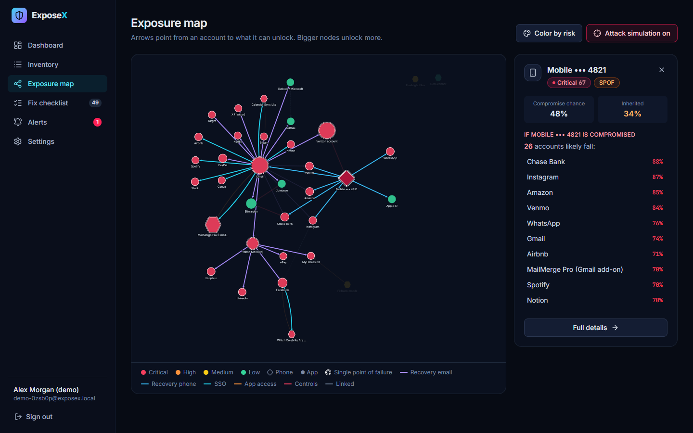
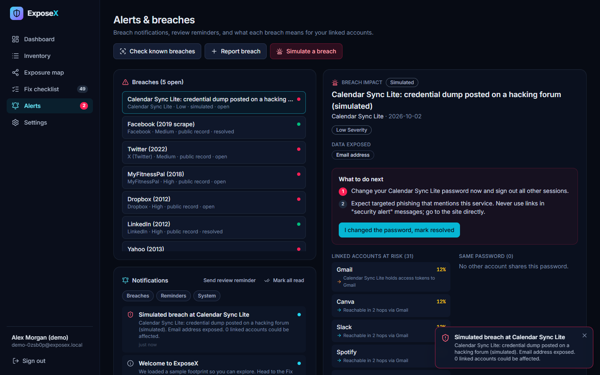
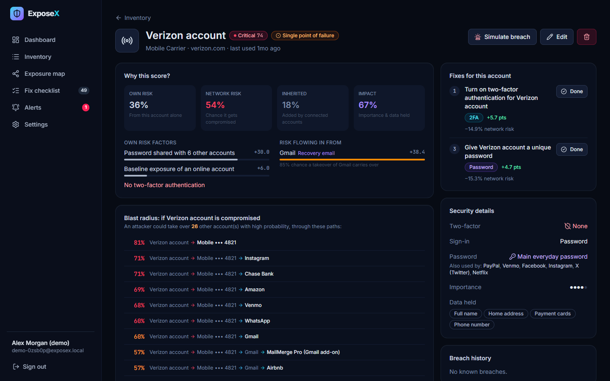
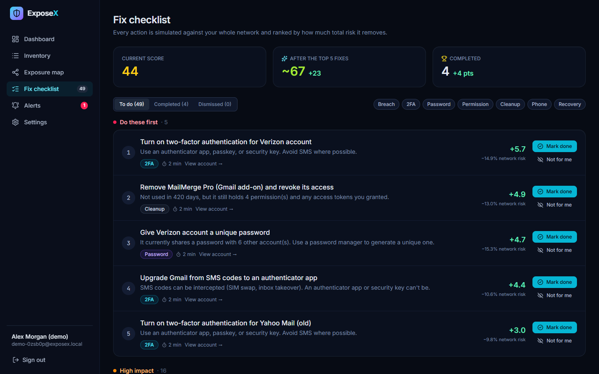

# ExposeX: Digital Footprint & Privacy Risk Auditor

> One compromised account can open the door to ten. ExposeX maps how your accounts, phone numbers and apps are wired together, scores risk **across the whole network**, finds your single points of failure, and ranks the fixes that remove the most risk.


Most security tools check one password or one breach at a time. Real exposure comes from the connections: the inbox that can reset ten accounts, the phone number that receives every reset code, the forgotten Gmail add-on that can still read your mail. ExposeX models those links explicitly and propagates risk through them.

---

## Features

| Requirement | What ExposeX does |
|---|---|
| **1. Accounts & apps inventory** | Track online accounts, phone numbers and third-party apps: service type, importance, 2FA method, sign-in methods, permissions (location, contacts, camera, mail access…), data held, last activity, and **password-reuse groups** (labels only; real passwords are never stored). Connections (recovery email, recovery phone, SSO, OAuth grants, "controls", linked) are added inline when creating an account or from the account page. |
| **2. Exposure mapping & risk scoring** | A directed control graph plus a Monte Carlo **independent-cascade** model (below). Every node gets *own risk*, *network risk*, *inherited risk*, *impact* and a **blast radius**. Nodes that unlock 3 or more accounts are flagged as **single points of failure**. Every score has a factor-by-factor explanation. |
| **3. Fix checklist** | Candidate fixes (enable/upgrade 2FA, break password reuse, resolve breaches, revoke permissions, remove abandoned apps, delete dormant accounts, add a carrier PIN, repoint recovery away from dead inboxes) are each **simulated against the whole graph** and ranked by the score points they add. Mark done or dismiss; history is kept. |
| **4. Search & filters** | Full-text search plus filters for risk level, service type, data shared / permission granted, 2FA status (none, weak, strong), last activity, password reuse, and SPOF. Sortable columns; filters live in the URL so views are shareable. |
| **5. Reminders & breach alerts** | Background scheduler sends **periodic review prompts** and optional **simulated breach drills**. You can check accounts against a reference list of public breaches, or report one manually. Every breach produces an **impact report**: which linked accounts an attacker can reach (with path and probability), which accounts share the password, and numbered next steps. Alerts are pushed live over Server-Sent Events. |
| **6. Privacy dashboard** | Overall privacy score (gauge plus sub-scores), improvement-over-time chart annotated with completed fixes, riskiest accounts, single points of failure with their dependents, an interactive connection graph, and top fixes with one-click completion. |

**Extras:** an interactive exposure map with *attack simulation* mode (click any node to light up everything an attacker could reach from it), color-by-password-reuse view, JSON export/import, a one-click demo footprint, responsive layout down to phone width.

| Exposure map, attack simulation | Breach impact report |
|---|---|
|  |  |

| Account risk explanation | Fix checklist |
|---|---|
|  |  |

---

## Quick start

Requirements: **Node.js ≥ 22.13**. SQLite is provided by the built-in `node:sqlite`, so there are no native builds.

```bash
npm install          # installs server + client workspaces
npm run build        # builds the React client into client/dist
npm run seed         # optional: creates demo@exposex.app / demo12345 with sample data
npm start            # serves API + app on http://localhost:4000
```

Development (hot reload for both halves):

```bash
npm run dev          # API on :4000, Vite dev server on http://localhost:5173 (proxies /api)
```

Or skip sign-up: click **"Explore instantly with a demo footprint"** on the login page. It creates a throwaway account loaded with a realistic, messy sample footprint (35 nodes, 44 connections, real public breaches, three months of history).

Tests:

```bash
npm test             # 17 tests: risk engine properties + API integration
```

### Configuration

| Env var | Default | Purpose |
|---|---|---|
| `PORT` | `4000` | HTTP port |
| `EXPOSEX_DB` | `data/exposex.db` | SQLite file path |
| `EXPOSEX_SECRET` | generated once and stored in DB | HMAC secret for auth tokens |
| `SCHEDULER_TICK_MS` | `60000` | How often reminders / breach drills are evaluated |

---

## The risk model

All weights live in [`server/src/engine/constants.js`](server/src/engine/constants.js); the model is in [`server/src/engine/risk.js`](server/src/engine/risk.js).

### 1. Intrinsic risk `p` (each node on its own)

Additive contributions, then multiplied by the account's 2FA factor:

- **Baseline:** accounts 0.06; phone numbers 0.14 for SIM-swap risk (0.05 with a carrier PIN); apps 0.08, more if unused for 180+ days or holding sensitive permissions.
- **Password reuse:** +0.10, plus 0.04 per extra account in the group. +0.30 more if any sibling has an **open breach that exposed passwords** (credential stuffing).
- **Breaches:** open breaches add 0.07 to 0.35 by severity (halved if passwords weren't exposed). Recently resolved breaches add a small phishing residue.
- **Dormancy:** +0.06 after a year unused, +0.10 after two (nobody notices a takeover).
- **Passwordless sign-in** (passkey/SSO only) discounts credential risks by 40%.
- **2FA factor:** none ×1.0 · email ×0.75 · SMS ×0.55 · push ×0.35 · authenticator ×0.30 · security key ×0.12 · passkey ×0.10.

### 2. Control edges `t` (how risk travels)

A link `A → B` means *compromising A gives an attacker a chance `t` of taking over B*:

| Link | Base `t` | Blocked by B's 2FA? |
|---|---|---|
| SSO ("Sign in with A") | 0.95 | No: A's session *is* the login |
| Recovery email | 0.85 | Yes, by 2FA strength, **unless B's 2FA is email codes** (same channel) |
| Controls (carrier → number, password manager → vault) | 0.80 | n/a |
| Recovery phone | 0.75 | Yes, **unless B's 2FA is SMS** (attacker already owns the number) |
| OAuth app access | 0.7 × scope power | No: tokens bypass 2FA. Scope power comes from the app's permissions (mail read 0.8, send 0.5, files 0.3…) |
| Linked | 0.30 | Partially |

### 3. Network risk `P`: independent-cascade Monte Carlo

In each of 4,000 simulated worlds, every node is compromised initially with probability `p`, and every edge "works" with probability `t`. `P` is the fraction of worlds in which a node ends up reachable from a compromised node.

Why not a closed-form noisy-OR fixed point? Because real footprints have cycles (phone → Gmail → carrier account → phone), and fixed-point propagation lets a node's own risk loop back and inflate itself. The cascade simulation counts each attack path correctly.

Random draws are a **deterministic hash of (world, node/edge id)**, which gives two properties:
- identical inputs always give identical scores;
- *common random numbers*: when comparing before/after for a fix, both runs see the same worlds, so the difference is low-variance even with few samples.

### 4. Blast radius & single points of failure

For each node, assume only that node is compromised and run the cascade. What falls is due purely to wiring. The expected impact of what falls is the blast radius; ≥3 accounts at ≥40% is a **single point of failure**. The most probable attack path to each dependent (max-product path) is shown in the UI.

### 5. Scores

- **Account risk (0–100)** combines network risk `P`, impact (importance, data sensitivity, permissions), and cascade potential (blast radius).
- **Overall privacy score** = `100 × (1 − (0.60·security + 0.25·privacy + 0.15·hygiene))`, where
  - *security* = impact-weighted mean of `P` (already network-aware),
  - *privacy* = accumulated exposure from sensitive permissions, amplified when the holder is unused,
  - *hygiene* = share of important accounts without strong 2FA.

### 6. Fix ranking

Each candidate fix is a pure **mutation** of the footprint. The engine applies it to a copy, re-runs the network model and records the score gain. Fixes are sorted by gain, then raw risk reduction, then effort. As a result, *2FA on the carrier account that controls the phone number that recovers your main inbox* can outrank *2FA on your bank*. That is the point of network-aware scoring.

---

## Architecture

```
ExposeX/
├── server/                    Express 5 · node:sqlite · zod
│   ├── src/engine/            Pure, framework-free risk engine
│   │   ├── constants.js       Catalogs & tunable weights
│   │   ├── risk.js            Intrinsic risk, transmission, Monte Carlo cascade, blast radius, scores
│   │   ├── fixes.js           Candidate generation + what-if simulation ranking
│   │   └── breach.js          Breach impact analysis & next steps
│   ├── src/api.js             REST API (auth, inventory, links, analysis, fixes, breaches, alerts, export/import)
│   ├── src/services.js        Per-user analysis cache, SSE hub, breach reporting
│   ├── src/scheduler.js       Review reminders & simulated breach drills
│   ├── src/repo.js            Data access (rows ↔ engine objects)
│   ├── src/seed.js            Sample footprint with replayed history
│   └── test/                  node:test suites (engine + API)
└── client/                    React 19 · Vite · TypeScript · Tailwind v4
    └── src/
        ├── pages/             Dashboard, Inventory, AccountDetail, GraphPage, Fixes, Alerts, Settings, Auth
        ├── components/        ExposureGraph (Cytoscape), AccountForm, UI kit, Toasts, Layout
        └── lib/               API client, auth context, React Query hooks, SSE, formatting
```

- **Auth:** scrypt password hashing, HMAC-signed bearer tokens (7-day expiry); every query is scoped by user id.
- **Caching:** analysis is cached per user against a fingerprint of their footprint and recomputed only after a change.
- **Live updates:** `GET /api/events` (SSE) pushes `notification` and `footprint` events; the client invalidates React Query caches and shows toasts.

### API overview

| Method & path | Description |
|---|---|
| `POST /api/auth/register` · `/login` · `/demo` | Auth (demo creates a seeded throwaway account) |
| `GET/PATCH /api/me`, `POST /api/me/review` | Settings, mark periodic review complete |
| `GET /api/accounts?q&kind&risk&type&data&twofa&activity&reused&spof&sort&dir` | Search & filter inventory (with risk) |
| `GET/POST/PATCH/DELETE /api/accounts/:id` | Account CRUD; `GET` includes risk breakdown, blast radius, links, fixes, breaches |
| `GET/POST/PATCH/DELETE /api/groups` | Password-reuse groups |
| `GET/POST/DELETE /api/links` | Connections |
| `GET /api/dashboard`, `GET /api/graph` | Dashboard aggregate; graph nodes/edges with dependents |
| `GET /api/fixes`, `POST /api/fixes/complete · dismiss · restore` | Prioritized checklist |
| `GET /api/breaches`, `GET /api/breaches/:id/analysis` | Breaches and impact report |
| `POST /api/breaches` · `/simulate` · `/scan` · `/:id/resolve` | Report, drill, check reference list, resolve |
| `GET /api/notifications`, `POST …/:id/read`, `…/read-all` | Alerts |
| `GET /api/events` | Server-Sent Events stream |
| `GET /api/export`, `POST /api/import`, `POST /api/reset-sample`, `POST /api/clear` | Data portability |

---

## Privacy & limitations

- ExposeX **never asks for or stores real passwords**: only user-chosen labels for which accounts share one.
- The breach check uses a small **offline reference list** of well-known public breaches. A production deployment should query a breach-intelligence API such as Have I Been Pwned. Simulated breaches are clearly labelled as simulations everywhere they appear.
- Risk weights are a reasoned starting point, not empirical probabilities. They are centralized so they can be calibrated.
